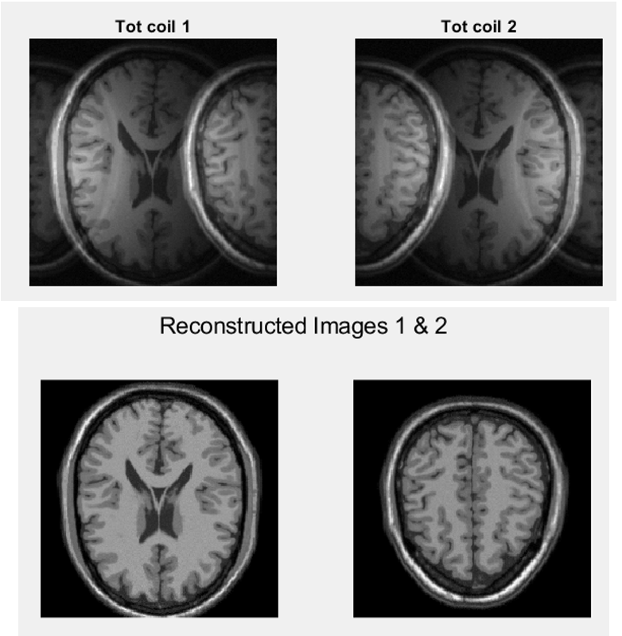

# Comparative G-Factor Analysis of MS-SENSE and MS-CAIPIRINHA in Parallel MRI

## Overview
This repository contains the report for a project focused on the comparative analysis of **MS-SENSE** (Sensitivity Encoding) and **MS-CAIPIRINHA** (Controlled Aliasing in Parallel Imaging Results in Higher Acceleration) in parallel MRI.

The study evaluates the performance of these reconstruction techniques in terms of **g-factor**, a key metric that quantifies noise amplification during parallel imaging.

## Project Description
Using MATLAB simulations, this work investigates how different factors affect reconstruction quality, including:

- Coil sensitivity profiles (uniform vs exponential)
- Variations in coil sensitivity between slices
- Spatial overlap between aliased slices
- Phase modulation in k-space (CAIPIRINHA)

The goal is to understand under which conditions CAIPIRINHA provides advantages over SENSE.

## Code Structure

The repository includes two main MATLAB scripts:

- `SENSE_vs_CAIPI_simulation.m`  
  Main simulation script. It:
  - Loads the MRI dataset
  - Extracts slices
  - Simulates coil sensitivities
  - Generates aliased images (SENSE / CAIPIRINHA)
  - Performs reconstruction using pseudoinverse
  - Computes g-factor, condition number, and SNR
  - Produces visual results

- `plot_g_factor_analysis.m`  
  Post-processing script used to:
  - Compare SENSE vs CAIPIRINHA
  - Analyze g-factor trends as a function of `slice_modulation`
  - Generate logarithmic plots for performance evaluation

## Dataset
Simulations are based on a 3D T1-weighted MRI dataset:

- **File**: `T1_ICBM_normal_1mm_pn0_rf0.mnc`
- Resolution: 1×1×1 mm voxels
- Two slices were selected:
  - Central slice (z = 0)
  - Second slice at +30 mm

The dataset is **not included** in this repository.  
You can download it from BrainWeb or equivalent sources and place it in the project folder.

## How to Run

### 1. Requirements
- MATLAB (tested on recent versions)
- Function `loadminc` (not included in this repository)

> **Note:** `loadminc` is not a built-in MATLAB function.  
> It may require external toolboxes or custom implementations.

### 2. Dataset
Download the dataset manually:

- Source: BrainWeb / ICBM dataset
- File required: `T1_ICBM_normal_1mm_pn0_rf0.mnc`

Place the file in the same folder as the MATLAB scripts.

### 3. Run Simulation

Open MATLAB and run:

```matlab
SENSE_vs_CAIPI_simulation

This script performs:
- Slice extraction from the 3D MRI volume  
- Coil sensitivity simulation  
- SENSE or CAIPIRINHA reconstruction  
- g-factor and SNR computation  

#### Key parameters (editable inside the script)

- **`slice_modulation`**  
  Controls similarity between coil sensitivities:
  - `1` → identical sensitivities (**worst case**)  
  - `0` → perfectly distinct sensitivities (**ideal case**)  

- **`noise_level`**  
  Controls the level of added Gaussian noise  

- **`caipishift`**  
  Select reconstruction method:
  - `true` → CAIPIRINHA  
  - `false` → SENSE  

### 4. Run the analysis

To reproduce the g-factor comparison plots:

```matlab
plot_g_factor_analysis
```

This script generates:
- g-factor comparison between SENSE and CAIPIRINHA  
- Sensitivity analysis vs. slice modulation  
- Log-scale performance plots  

## Methodology

### Noise Modeling
Since the dataset is noise-free, **white Gaussian noise** was added in image space to simulate realistic acquisition conditions.

- Noise level: fixed (parameter `noise_level`)
- Noise assumed uncorrelated across coils

### Coil Configuration
- Two-coil system
- Each coil primarily sensitive to one slice
- Sensitivity difference controlled by `slice_modulation`:
  - `1` → identical sensitivities (worst case)
  - `0` → perfectly distinct sensitivities (ideal case)

### Reconstruction Methods

#### SENSE
- Reconstruction via inversion of coil sensitivity matrix
- Sensitive to ill-conditioning when coil profiles are similar

#### CAIPIRINHA
- Introduces **phase-cycling in k-space**
- Produces spatial shift between slices (FOV/2)
- Improves separability of aliased signals

Reconstruction is performed pixel-wise using the **pseudoinverse**, ensuring numerical stability.

### G-Factor Computation
The g-factor is computed pixel-by-pixel to quantify noise amplification:

- g ≈ 1 → optimal reconstruction
- High g → strong noise amplification

It depends on:
- Coil sensitivity matrix conditioning
- Spatial overlap between slices

## Results

### Uniform Coil Sensitivities
- SENSE and CAIPIRINHA show similar g-factor in overlapping regions
- CAIPIRINHA performs slightly better due to reduced overlap
- Overall performance comparable

### Exponential Coil Sensitivities (More Realistic Case)
- **SENSE**:
  - Very high g-factor (up to ~38)
  - Poor reconstruction quality

- **CAIPIRINHA**:
  - Significantly lower g-factor (~1–1.2)
  - Much better reconstruction quality
  - Horizontal shift performs better than vertical shift

## CAIPIRINHA Results Visualization



### Effect of Slice Modulation

#### Worst Case (slice_modulation → 1)
- Coil sensitivities nearly identical
- Both methods fail with uniform sensitivities
- With exponential sensitivities:
  - SENSE fails completely
  - CAIPIRINHA still succeeds

#### Ideal Case (slice_modulation = 0)
- Perfect separation between coils
- Both methods achieve:
  - g-factor = 1
  - High-quality reconstruction

### Non-Intuitive Behavior (slice_modulation ≈ 0.2)
- CAIPIRINHA shows a **g-factor peak**
- Caused by local similarity in coil sensitivities within overlapping regions
- Reconstruction becomes unstable in this specific configuration

## Key Insights

- CAIPIRINHA significantly outperforms SENSE in realistic conditions
- Performance gain comes from:
  - Reduced overlap
  - Improved conditioning of sensitivity matrix
- Coil sensitivity structure is critical for reconstruction quality
- Edge cases exist where CAIPIRINHA performance degrades

## Notes

- The code assumes fixed image dimensions (200×200).  
  Modifications may be needed for different datasets.

- The simulation is designed for:
  - 2 slices
  - 2 coils

## File
- 'SENSE_vs_CAIPI_simulation.m' → Main simulation
- 'plot_g_factor_analysis.m' → Analysis and plotting
- `FINAL_REPORT_MRI.pdf` → Full project report

## Author
Federica Maria Olivotto  
Technical University of Denmark
